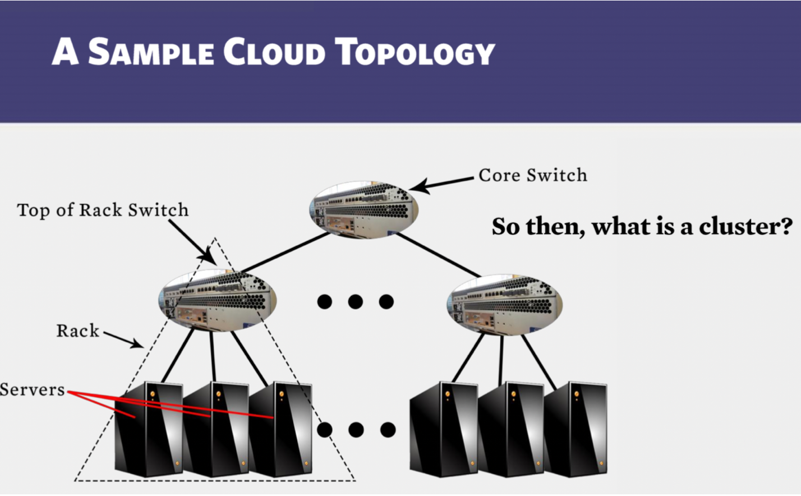
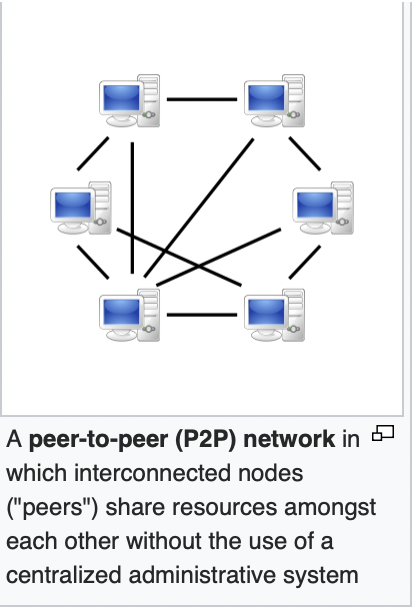
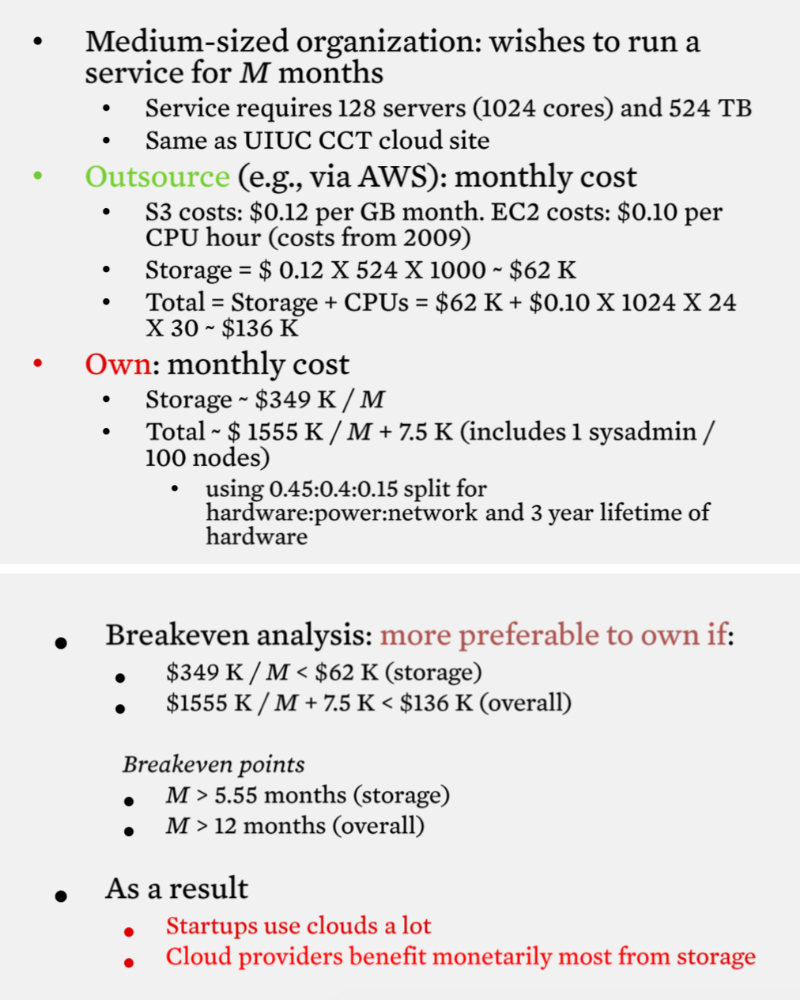
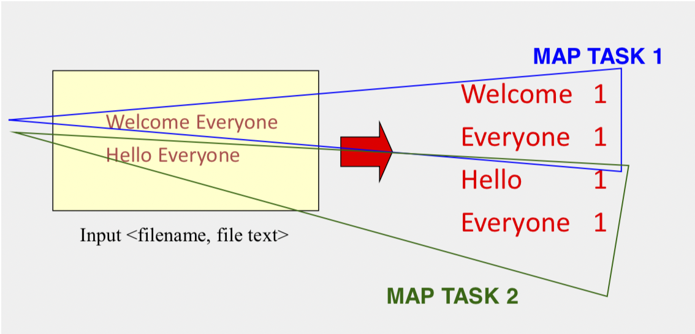
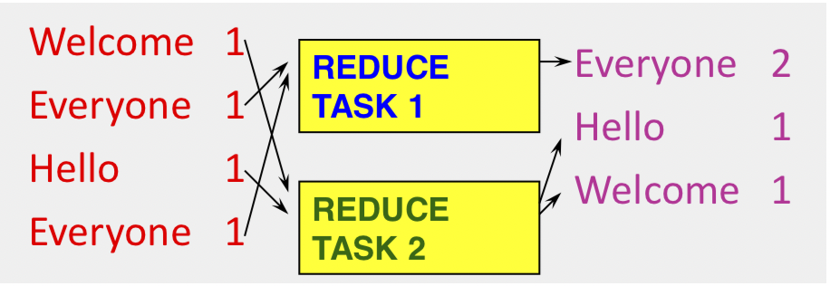
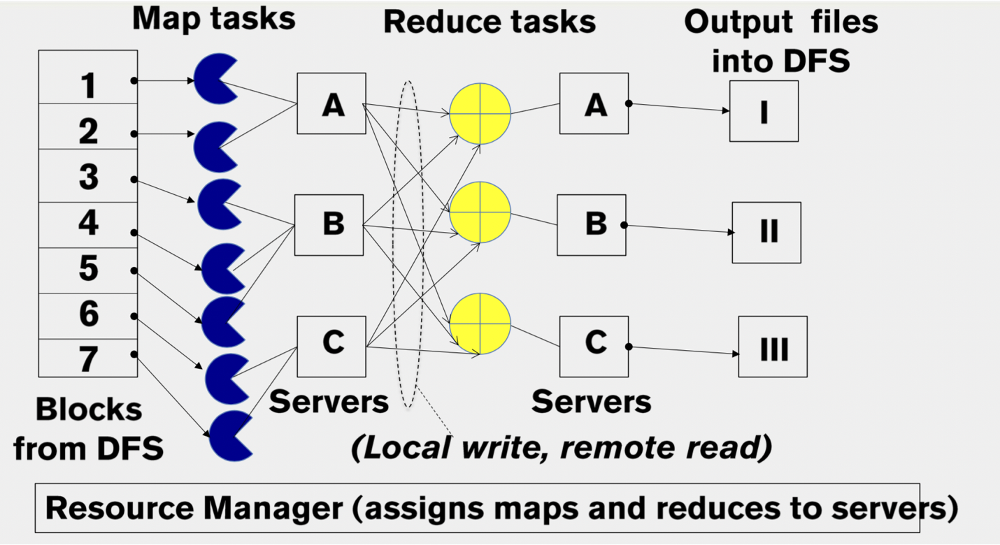
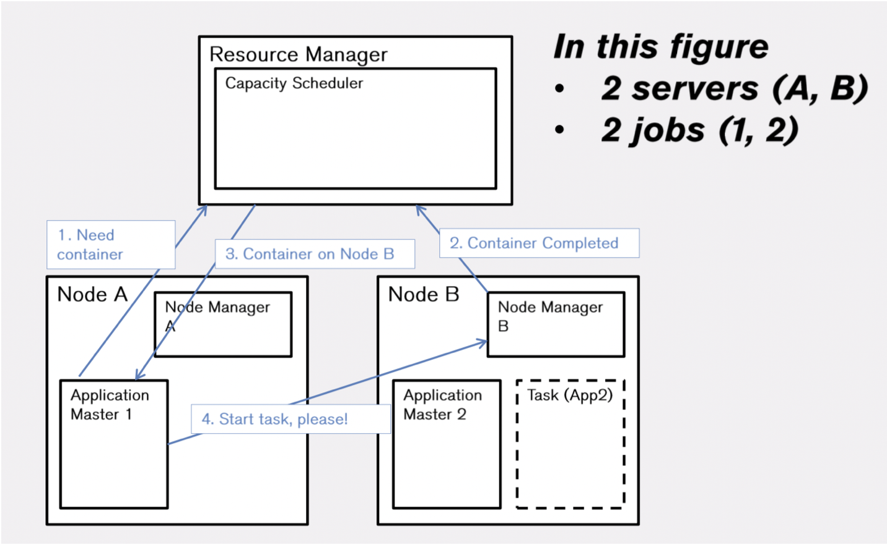
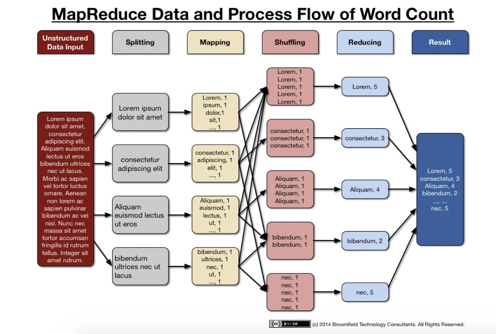
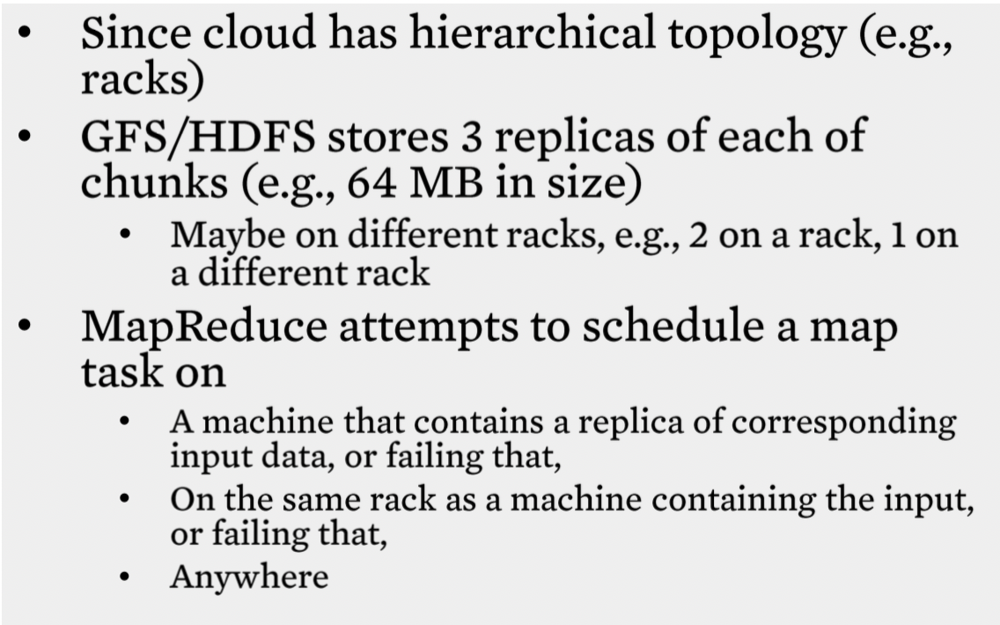

Table of Contents
=================

  * [Overview](#overview)
     * [Goals and Objectives](#goals-and-objectives)
     * [Key Phrases/Concepts](#key-phrasesconcepts)
     * [Guiding Questions](#guiding-questions)
  * [Introduction](#introduction)
     * [Two categories of cloud](#two-categories-of-cloud)
  * [What is a cloud?](#what-is-a-cloud)
     * [Four major characteristics](#four-major-characteristics)
  * [A cloud is a distribyted system](#a-cloud-is-a-distribyted-system)
  * [Economics of clouds](#economics-of-clouds)
  * [What is a distributed system](#what-is-a-distributed-system)
     * [Our interest in distributed systems involves](#our-interest-in-distributed-systems-involves)
  * [MapReduce paradigm](#mapreduce-paradigm)
     * [Map](#map)
     * [Reduce](#reduce)
  * [MapReduce Scheduling](#mapreduce-scheduling)
     * [The YARN SCHEDULER](#the-yarn-scheduler)
     * [MapReduce Example](#mapreduce-example)
  * [Fault tolerance](#fault-tolerance)
     * [stragglers](#stragglers)
     * [Locality](#locality)

## Overview
This week you will see what cloud computing is, a bit about its history and economics, and why cloud computing is all about distributed systems topics (which the course focuses on).

### Goals and Objectives
After you actively engage in the learning experiences in this module, you should be able to:

- Know the key differences between cloud computing and previous generations of distributed systems.
- Design MapReduce programs for a variety of problems.
- Know how Hadoop schedules jobs.

### Key Phrases/Concepts
Keep your eyes open for the following key terms or phrases as you complete the readings and interact with the lectures. These topics will help you better understand the content in this module.

- Clouds
- MapReduce paradigm
- Hadoop YARN

### Guiding Questions
Develop your answers to the following guiding questions while completing the readings and working on assignments throughout the week.

- Why is cloud computing popular today?
- What is different in cloud computing compared to previous generations of distributed systems?
- How does one program in MapReduce?
- How does the MapReduce system schedule jobs?

## Introduction

- Customers save money and time

### Two categories of cloud
1. public
    -  provide service to any paying customer
2. private
    - accessbile only to company employees

## What is a cloud?
1. Informal definition
    > lots of storage + compute circle nearby

2. Components
    1. a single-site cloud
        - Compute nodes (grouped into racks) (servers)
        - Switches, connecting the racks
        - A network topology, e.g. hierarchical
        - Storage(backend) nodes, connecting to the network
        - Front-end for submiting jobs and receiveing client requests
        - Software services
    2. a geographically distributed cloud
        - Mutiple such sites
        - Each site perhaps with different structures and services

### Four major characteristics
Distinguish today's clouds from previous generations of distributed computing systems and problems

1. **Massive scale**
    
    Massive-scale essentially means that data centers are very large. They contain tens of thousands, sometimes hundreds of thousands of servers and you could run your computation across as many servers as you want and as many servers as your application will scale
2. **On-demand access**
    
    Pay-as-you-go, no upfront commitment. Anyone can access it
    - HaaS: Hardware as a Service
    - IaaS: Infrastructure as a Service(Ex: Amazon Web Services (AWS: EC2 and S3))
    - PaaS: Platform as a Service(You get access to flexible computing and storage infrastructure, coupled with a software platform (often tightly), Ex: Google’s AppEngine (Python, Java, Go))
    - SaaS: Software as a Service(You get access to software services, when you need them. Often said to subsume SOA (Service Oriented Architectures), Ex: Google docs, MS Office on demand)
3. **Data-intensive Nature**
    
    - Typically store data at datacenters
    - Use compute nodes nearby
    - Compute nodes run computation services
    - In data-intensive computing, **the focus shifts from computation to the data**: CPU utilization no longer the most important resource metric, instead I/O is (disk and/or network)
    
4. **New Cloud Programming Paradigms**
    - MapReduce/Hadoop, NoSQL/Cassandra/MongoDB and many others.
    - Easy to write and run highly parallel programs in new cloud programming paradigms:

## A cloud is a distribyted system
1. A cloud consists of
    - Hundreds to thousands of machines in a datacenter (server side)
    - Thousands to millions of machines accessing these services (client side)
2. Servers communicate amongst one another
    - Distributed System
    - Essentially a cluster!
3. Clients communicate with servers
    - Also a distributed system!
4. Clients also communicate with each other
    - Also a distributed system!
    - 

5. **Four Features of Clouds = All Distributed Systems Features**
6. **Cloud = A Fancy Word for a Distributed System**

## Economics of clouds

## What is a distributed system

- A distributed system is a collection of independent computers that appear to the users of the system as a single computer.[Andrew Tanenbaum]
- A distributed system is several computers doing something together. Thus, a distributed system has three primary characteristics: multiple computers, interconnections, and shared state. [Michael Schroeder]
- A distributed system is a collection of entities, each of which is **autonomous**, **programmable**, **asynchronous** and failure- prone, and which communicate through an unreliable communication medium.
    - **programmable**,Eliminates “Humans Interacting with each other”
    - **asynchronous**, Distinguishes distributed systems from parallel systems (e.g., multiprocessor systems)

### Our interest in distributed systems involves
- algorithmics
- design and implementation
- maintenance, 
- study

## MapReduce paradigm
- (map square (1,2,3,4))
    - output: (1,4,9,16)
    process each record sequentially and independently

- (reduce + (1,4,9,16))
    - (+16 (+9 (+4)))
    - output: 30
    process set of all records in batches 

### Map
- Map task processes each record **sequentially and independently**
- **Parallelly** process different map tasks 
    

### Reduce
- Reduce process set of all records in batches
- Parallelly process by partitioning records
    

## MapReduce Scheduling

1. Externally, for the user:
    1. write map program, write reduce program
    2. submit job; wait for result
    3. need to know nothing about parallel programming
2. Internally, for the paradigm and scheduler
    1. Parallelize Map
        - each Map task is independent
        - all Map output records with the same key should assign to the same Reducer
    2. Transfer data from Map to Reduce
    3. Parallelize Reduce
        - each Reduce task is independent 
        - use partition function
    4. Implement Storage for Map input, Map output, Reduce input, Reduce output
        - Map input: DFS
        - Map output: local disk
        - Reduce input: remote disk
        - Reduce output: DFS

### The YARN SCHEDULER

- Used in Hadoop 2.x +
- YARN = Yet Another Resource Negotiator
- Treats each server as a collection of containers
    - Container = some CPU + some memory
- Has 3 main components
    - Global Resource Manager (RM)
        - scheduling
    - Per-server Node Manager (NM)
        - Daemon and server-specific functions
    - Per-application (job) Application Master (AM)
        - Container negotiation with RM and NMs
        - Detecting task failures of that job

### MapReduce Example

## Fault tolerance
- Server failure
    - NM,AM heartbeats to RM
    - NM keep track of each task running at its server
- RM failure
    - use old checkpoints and bring up secondary RM

### stragglers
-  the slowest machine slows the entire job
-  **speculative exection**: backup execction of straggler task

### Locality

**Reference from some slides from Coursera course [Cloud Computing](https://www.coursera.org/learn/cloud-computing)**
