Table of Contents
=================

  * [Overview](#overview)
     * [Goals and Objectives](#goals-and-objectives)
     * [Key Phrases/Concepts](#key-phrasesconcepts)
     * [Guiding Questions](#guiding-questions)
  * [Gossip](#gossip)
     * [what is multicast?](#what-is-multicast)
     * [What are the requirements for multicast protocol?](#what-are-the-requirements-for-multicast-protocol)
     * [Centralized Multicast Protocol](#centralized-multicast-protocol)
     * [Tree-Based Multicast Protocol](#tree-based-multicast-protocol)
     * [Epidemic Multicast](#epidemic-multicast)
     * [Topology-Aware Gossip](#topology-aware-gossip)
     * [Gossip Summary](#gossip-summary)
  * [Member](#member)
     * [Two sub-protocals](#two-sub-protocals)
     * [Failure Detection](#failure-detection)
        * [Gossip Style Failure Detection](#gossip-style-failure-detection)
        * [Swim Failure Detection](#swim-failure-detection)
     * [Dissemination](#dissemination)
     * [Suspicion Mechanism](#suspicion-mechanism)
     * [Member Summary](#member-summary)
  * [Grid](#grid)
  

## Overview

This week’s video lectures cover the topics of Grids, Membership, and Gossip. With this, you have all the concepts you need to complete the Programming Assignment in this course.

### Goals and Objectives

After you actively engage in the learning experiences in this module, you should be able to:

- Analyze various gossip/epidemic protocols.
- Design and analyze various distributed membership protocols.
- Know what grid computing is.

### Key Phrases/Concepts

Keep your eyes open for the following key terms or phrases as you interact with the lectures. These topics will help you better understand the content in this module.

- Failure detectors
- Membership protocols
- Gossip/epidemic protocols
- Grid computing

### Guiding Questions

Develop your answers to the following guiding questions while completing the activities throughout the week.

- Why are gossip and epidemic protocols fast and reliable?
- What is the most efficient way for cloud computing systems to detect failures of servers?
- How is grid computing related to cloud computing?

## Gossip

### what is multicast? 

Suppose you have a group of processes or a group of nodes. Each of these processes or each of these nodes is potentially a process at some host on the Internet or connected to the network. And essentially, all we need is that these processes or nodes need to be able to talk with each other by being able to **send** and **receive** messages.

### What are the requirements for multicast protocol?

- fault tolerance
- scalability

### Centralized Multicast Protocol

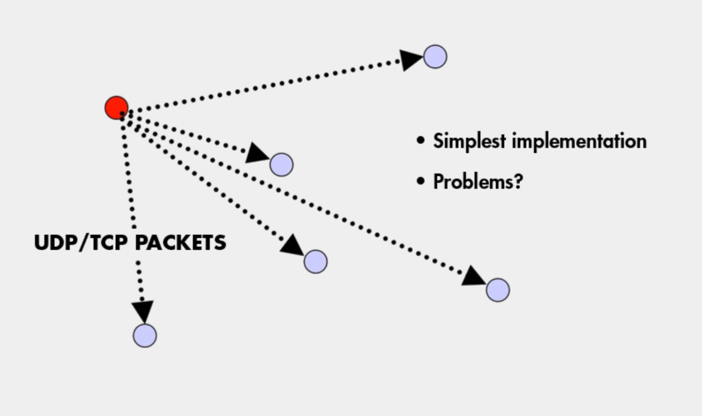

- If the sender fails, no one can received the multicast.
- the overhead on the sender is very high.  O(n)

### Tree-Based Multicast Protocol
- Build a spanning tree among the processes of the multicast group
- Use spanning tree to disseminate multicasts
- Use either acknowledgments (ACKs) or negative acknowledgements (NAKs) to repair multicasts not received
- **SRM** (Scalable Reliable Multicast)
    - Uses NAKs
    - But adds random delays, and uses exponential backoff to avoid NAK storms
- **RMTP** (Reliable Multicast Transport Protocol)
    - Uses ACKs
    - But ACKs only sent to designated receivers, which then re-transmit missing multicasts
- These protocols still cause an O(N) ACK/NAK overhead
- 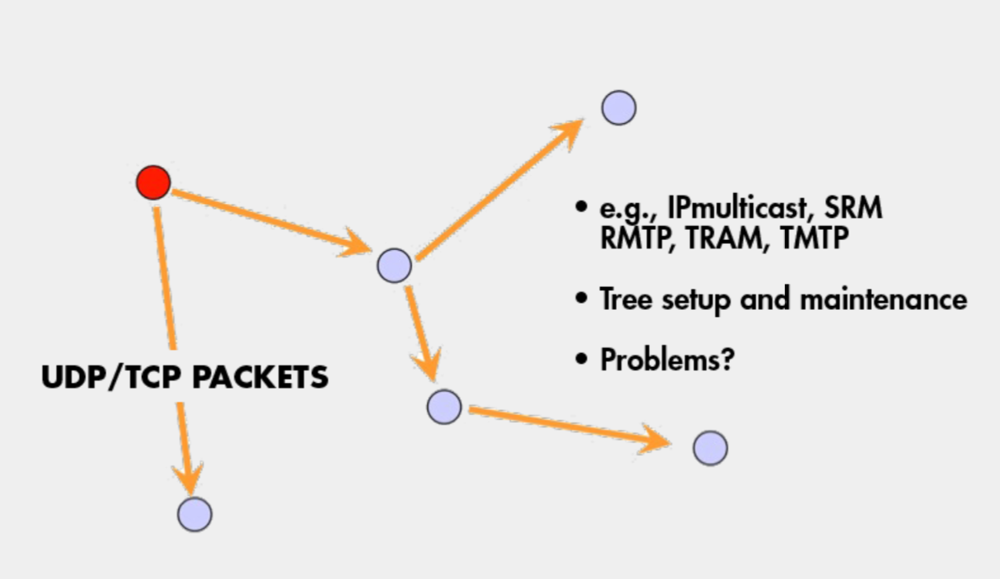

### Epidemic Multicast
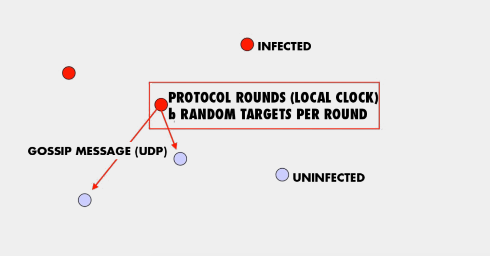

the sender periodically picks b nodes as gossip targets and sends them copies of the multicast message using what is known as a gossip message. When b turns from uninfected into infected they starts periodically sending out gossip message.  

- **Push** gossip
    - Once you have a multicast message, you start gossiping about it
    - Multiple messages? Gossip a random subset of them, or recently-received ones, or higher priority ones
- **Pull** gossip
    - Periodically poll a few randomly selected processes for new multicast messages that you haven’t received
    - Get those messages
- **Hybrid variant**: Push-Pull
    - As the name suggests

### Topology-Aware Gossip
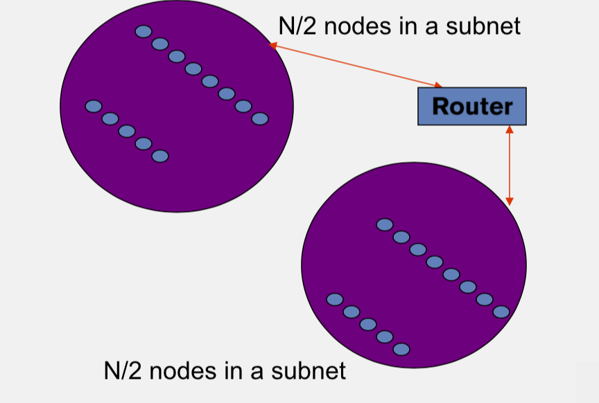

- Network topology is hierachical
- Random gossip target selection => core routers face O(N) load
- In subnet i, which contains $n_i$ nodes, pick gossip target in your subnet with probability $\frac{1}{n_i}$
- Router $load=O(1)$
- Dissemination $time=O(log(N))$

### Gossip Summary

- Multicast is an important problem
- Tree-bases multicast protocols
- When concerns the scalability and fault tolerance, the gossip protocol is a good choice
- Also known as epidemic
- Fast, reliable, Fault-tolerant, scalability, topology-aware

## Member

The membership list Which maintains the list of most or all of the other processes that are currently in your system and that have not yet failed. That means non-faulty processes. This membership list is accessed by a variety of applications, for instance the application might be a distributed hash table.

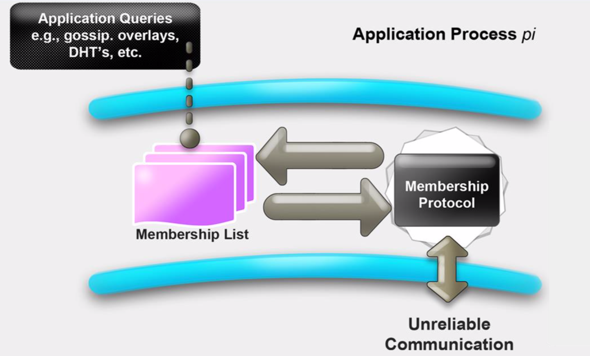

### Two sub-protocals

- Failure Detection
- Dissemination

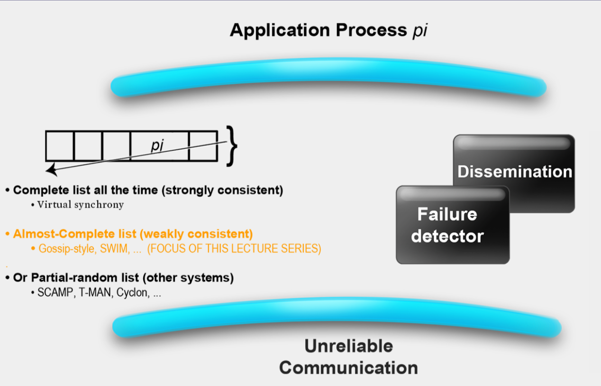

### Failure Detection
some process find out the failure process quickly

- Desirable propertities
    - Completeness (most important)
    - Accuracy
    - Speed
    - Scale

#### Gossip Style Failure Detection
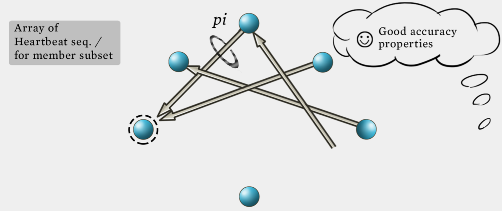
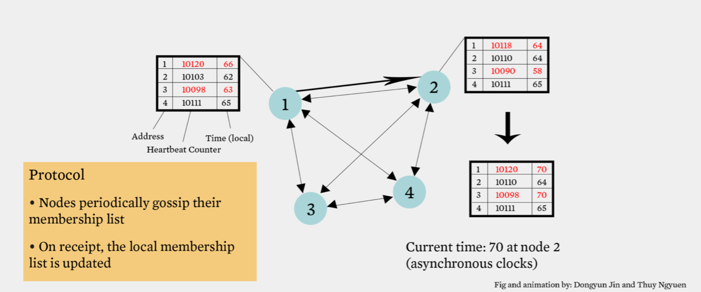

1. If the heartbeat has not increased for more than $T_{tail}$ seconds, the member is considered fail.
2. After $T_{cleanup}$ seconds, it will delete the member from the list.
3. N heartbeats take:
    - O(log(n)) time to propagate if bandwith allowed per node is O(n)
    - O(Nlog(n)) time to propagate if bandwith allowed per node is O(1)
4. Multi-level Gossip
    - 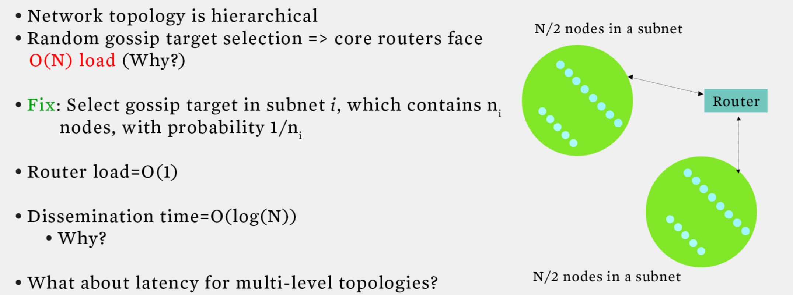
5. All-to-all and gossip-based heartbeating are in fact suboptimal because they have in fact they are O(Nlog(N)) for the gossip-based heartbeating. The key here is to realize that these two protocols mix up the **failure detection** and the **dissemination components**. Essentially they are trying to have all the processes in the system detect the failure by themselves and not really using dissemination component separately.

#### Swim Failure Detection
- Two choice for the $P_j$(failure process)
- Directed ping to $P_j$ and indirected ping to $P_j$ (Randomly select another process and then send ping to $P_j$)
- Constant time => $O(1)$
- 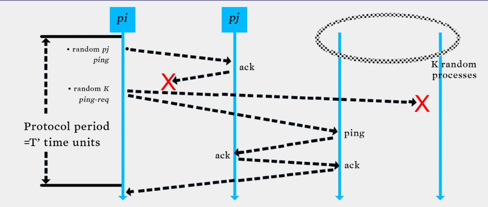

### Dissemination 
- Multicast Dissemination(Hardware/IP)
    - unreliable
- Point-to-Point 
    - expensive
- Infection style Dissemination

### Suspicion Mechanism
Suspect a process before **declaring** it as failed in the group

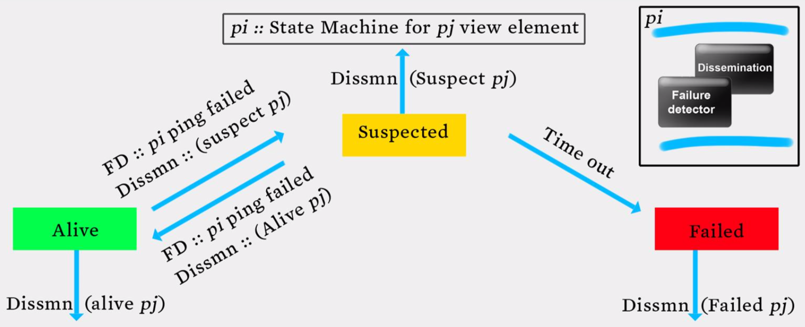

### Member Summary

- 在数据中心中，出错是常态，并不是意外
- 每一个分布式系统都会使用错误检测器
- 很多分布式系统使用了成员关系服务
- 使用环形错误检测的有
    – IBM SP2和很多其他相似的集群/机器
- 使用流言式的错误检测的有
    – 亚马逊Amazon EC2/S3

## Grid

> src: https://www.zhihu.com/question/20773707/answer/16583447
网格计算的设计目标是解决对于任何单一的超级计算机来说仍然大得难以解决的问题，并同时保持解决多个较小的问题的灵活性。这样，网格计算就提供了一个多用户环境。它的第二个目标就是：更好的利用可用计算力，迎合大型的计算练习的断断续续的需求。有了网格计算技术，您可以将服务器、存储系统和网络联合在一起，组成一个大的系统，从而为用户提供功能强大的多系统资源来处理特定的任务。对于最终用户或应用程序来说，数据文件、应用程序和系统看起来就像是一个巨大的虚拟计算系统。网格计算与其他所有的分布式计算范例都有所区别：网格计算的本质在于以有效且优化的方式来利用组织中各种异构松耦合资源，来实现复杂的工作负载管理和信息虚拟化功能。

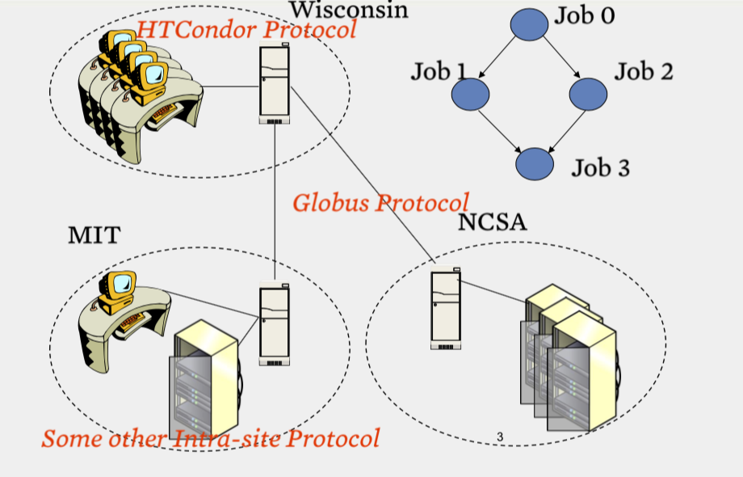

two level scheduling infrastructure

- Inter-site protol
- Globus
- No single entity controls the entire infrastructure(federate)

网格通常使用两级调度基础架构，每个站点都运行一个站内协议，然后不同站点之间有一个协议。有时候，站内和站间协议可以是一种通用的协议。协议会进行任务的分发，决定哪个任务工作在哪个机器上面。计算资源空闲的时候，会运行协议的守护进程，去访问协议的中央服务器，寻求任务，此时协议将会分发一个任务给该计算资源。如果任务完成过程中，计算资源被本地用户使用，此时意味着计算资源不是闲置的了。那么它会停止手头得到的子任务，要么直接杀死子任务的进程，要么将中间结果整理之后返回中央服务器，以便后续的计算资源接手其任务继续运算。但是通常而言，协议的策略都是直接杀死子任务，不再返回中间结果了，因为这样的实现方法要简单一些。

**Reference from some slides from Coursera course [Cloud Computing](https://www.coursera.org/learn/cloud-computing)**
