Table of Contents
=================

  * [Overview](#overview)
     * [Goals and Objectives](#goals-and-objectives)
     * [Key Phrases/Concepts](#key-phrasesconcepts)
     * [Guiding Questions](#guiding-questions)
  * [Why Study Peer-to-Peer Systems?](#why-study-peer-to-peer-systems)
  * [Napster](#napster)
     * [Napster Structure](#napster-structure)
     * [Client](#client)
     * [Joining a P2P system](#joining-a-p2p-system)
     * [Problems for Napster](#problems-for-napster)
  * [Gnutella](#gnutella)
     * [Gnutella Structure](#gnutella-structure)
     * [How do I search for my Beatles file?](#how-do-i-search-for-my-beatles-file)
        * [Payload Format in Gnutella Query Message](#payload-format-in-gnutella-query-message)
        * [Payload Format in Gnutella QueryHit Message](#payload-format-in-gnutella-queryhit-message)
     * [Avoiding excessive traffic](#avoiding-excessive-traffic)
     * [After receiving QueryHit messages](#after-receiving-queryhit-messages)
     * [Dealing with Firewalls](#dealing-with-firewalls)
     * [Ping-Pong](#ping-pong)
     * [Gnutella Summary](#gnutella-summary)
  * [FastTrack](#fasttrack)
     * [FastTrack Structure](#fasttrack-structure)
  * [BitTorrent](#bittorrent)
     * [BitTorrent Structure](#bittorrent-structure)
     * [BitTorrent 原理简述](#bittorrent-原理简述)
  * [Chord](#chord)
     * [Comparative Performance](#comparative-performance)
     * [Chord Structure](#chord-structure)
        * [successors](#successors)
        * [finger tables](#finger-tables)
     * [Files](#files)
     * [Search](#search)
     * [Dynamic changes](#dynamic-changes)
     * [Virtual Nodes](#virtual-nodes)
  * [Pastry](#pastry)
     * [Pastry Locality](#pastry-locality)
     * [Kelips](#kelips)
     * [Kelips Structure](#kelips-structure)

## Overview

This week we will focus on Peer-to-Peer Systems. This area is important because it is a precursor to today's cloud computing. The topic is thus a good segue for us to discuss Key-value Stores next week (Week 4).

### Goals and Objectives

After you actively engage in the learning experiences in this module, you should be able to:

- Know how Napster, Gnutella, FastTrack, and BitTorrent work.
- Know and analyze how distributed hash tables work (Chord, Pastry, and Kelips).

### Key Phrases/Concepts

Keep your eyes open for the following key terms or phrases as you interact with the lectures. These topics will help you better understand the content in this module.

- Peer-to-peer systems
- Industrial P2P systems: Napster, Gnutella, FastTrack, BitTorrent
- Distributed hash tables: Chord, Pastry, Kelips

### Guiding Questions

Develop your answers to the following guiding questions while completing the readings and working on assignments throughout the week.

- What is the difference between how Napster clients and Gnutella clients search for files?
- What is the difference between Gnutella and FastTrack?
- What is BitTorrent’s tit for tat mechanism?
- What is consistent hashing?
- Why are DHTs efficient in searching?
- How does Chord route queries?
- How does Pastry route queries?
- How does Kelips route queries?
- What is churn in P2P systems?
- How does Chord maintain correct neighbors in spite of failures and churn?


## Why Study Peer-to-Peer Systems?

- First distributed systems that seriously focused on **scalability** with respect to number of nodes
- P2P techniques abound in cloud computing systems


## Napster
(创始人Sean Parker, 看Social Network时有讲到，哈哈)

### Napster Structure
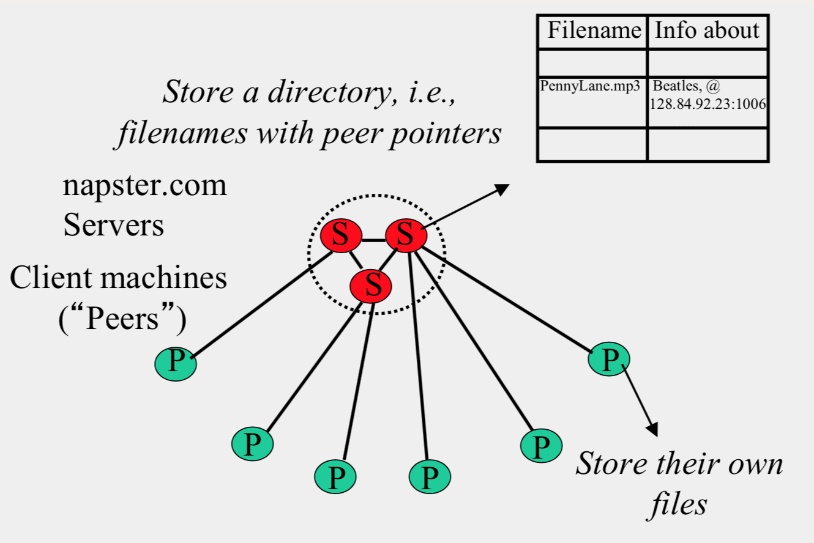

### Client
- Connect to a Napster server
    - Upload list of music files that you want to share
    - Server maintains list of {filename, ip\_address, port\_num} tuples. 
    - **Server stores no files**.
- Search
    - Send server keywords to search with
    - Server searches its list with the keywords
    - Server returns a list of hosts – {ip\_address, portnum} tuples – to client
    - Client pings each host in the list to find transfer rates
    - Client fetches file from best host
- All communication uses TCP (Transmission Control Protocol)
    - Reliable and ordered networking protocol
    - 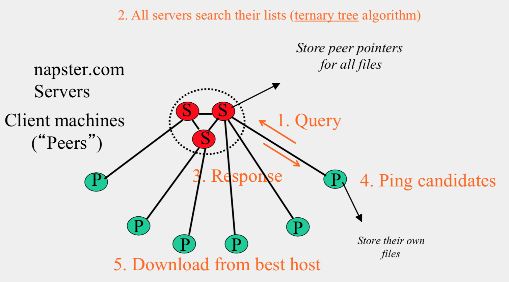


### Joining a P2P system
- Send an http request to well-known url for that P2P service - http://www.myp2pservice.com
- Message routed (after lookup in DNS) to introducer, a well known server that keeps track of some recently joined nodes in p2p system
- Introducer initializes new peers’ neighbor table


### Problems for Napster
- Centralized server a source of congestion
- Centralized server single point of failure
- No security: plaintext messages and passwds
- Napster.com declared to be responsible for users’ copyright violation
    - “Indirect infringement”


## Gnutella
- Eliminate the servers
- Client machines search and retrieve amongst themselves
- Clients act as servers too, called **servents**
- Gnutella protocol has 5 main message types
    - Query (search)
    - QueryHit (response to query)
    - Ping (to probe network for other peers)
    - Pong (reply to ping, contains address of another peer)
    - Push (used to initiate file transfer)

### Gnutella Structure
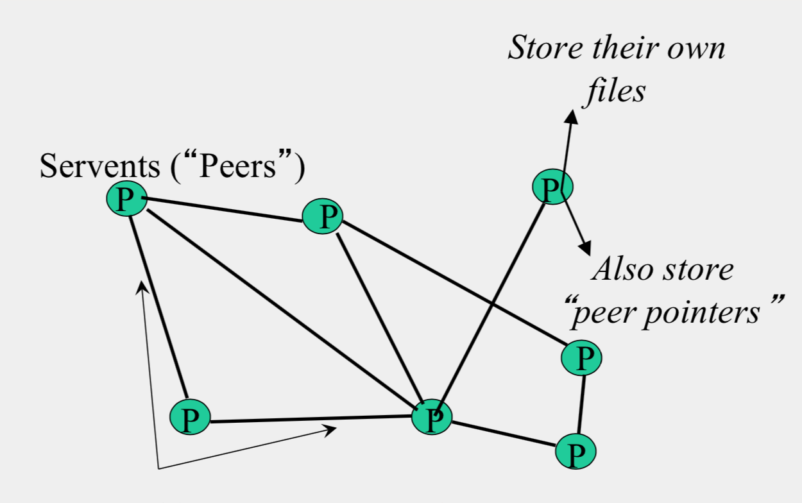
- Connected in an **overlay graph**

### How do I search for my Beatles file?
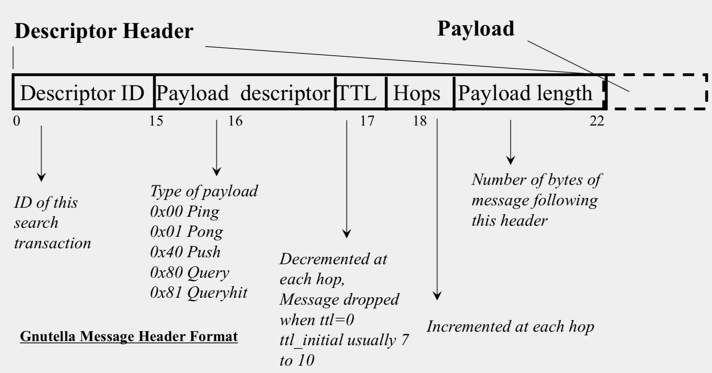

#### Payload Format in Gnutella Query Message
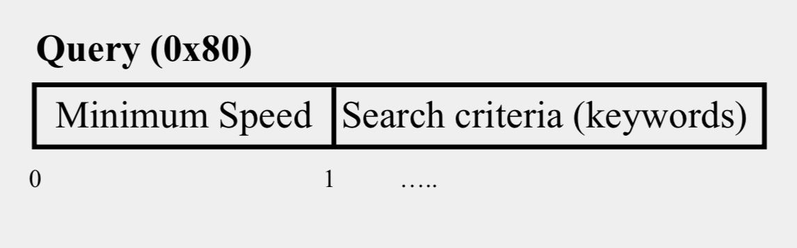

#### Payload Format in Gnutella QueryHit Message
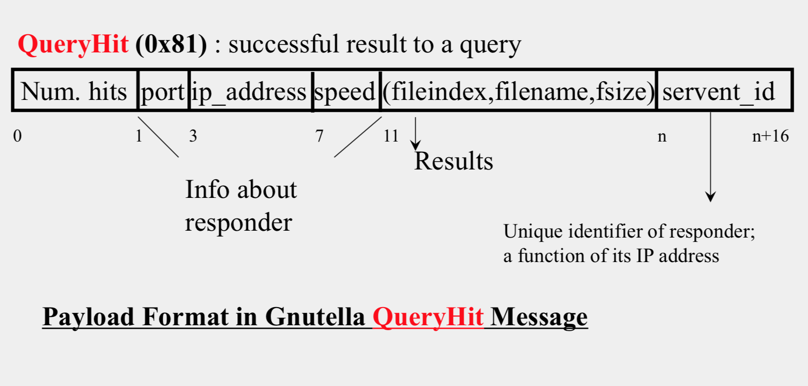

### Avoiding excessive traffic
- To avoid duplicate transmissions, each peer maintains a list of recently received messages
- Query forwarded to all neighbors except peer from which received
- Each Query (identified by DescriptorID) forwarded only once
- QueryHit routed back only to peer from which Query received with same DescriptorID
- Duplicates with same DescriptorID and Payload descriptor (msg type) are dropped
- QueryHit with DescriptorID for which Query not seen is dropped

### After receiving QueryHit messages
- Requestor chooses “best” QueryHit responder
```HTML
GET /get/<File Index>/<File Name>/HTTP/1.0\r\n
Connection: Keep-Alive\r\n 
Range: bytes=0-\r\n 
User-Agent: Gnutella\r\n \r\n
```
- Responder then replies with file packets after this message:
```HTML
HTTP 200 OK\r\n
Server: Gnutella\r\n 
Content-type:application/binary\r\n 
Content-length: 1024 \r\n
\r\n
```

### Dealing with Firewalls
- Requestor sends Push to responder asking for file transfer
- 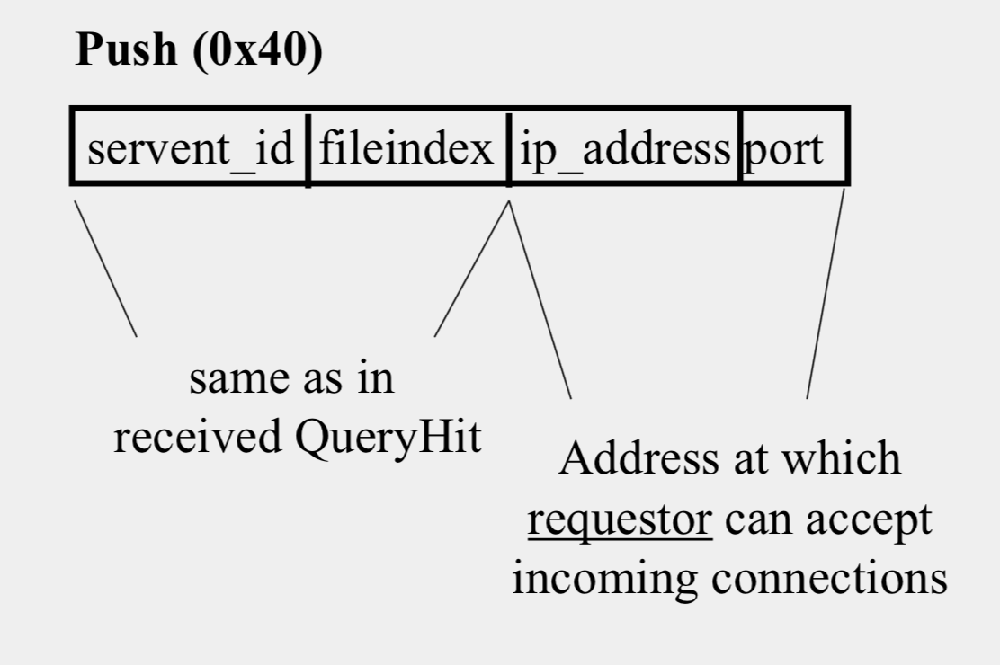
- Responder establishes a TCP connection at ip_address, port specified. 
- Requestor then sends GET to responder (as before) and file is transferred as explained earlier

### Ping-Pong
- Peers initiate Ping’s periodically
- Ping’s flooded out like Query’s, Pong’s routed along reverse path like QueryHit’s
- Pong replies used to update set of neighboring peers
    - To keep neighbor lists fresh in spite of peers joining, leaving and failing

### Gnutella Summary
- No servers
- Peers/servents maintain “neighbors,” this forms an overlay graph
- Peers store their own files
- Queries flooded out, ttl restricted
- QueryHit (replies) reverse path routed
- Supports file transfer through firewalls
- Periodic ping-pong to continuously refresh neighbor lists


## FastTrack
- Hybrid between Gnutella and Napster

### FastTrack Structure
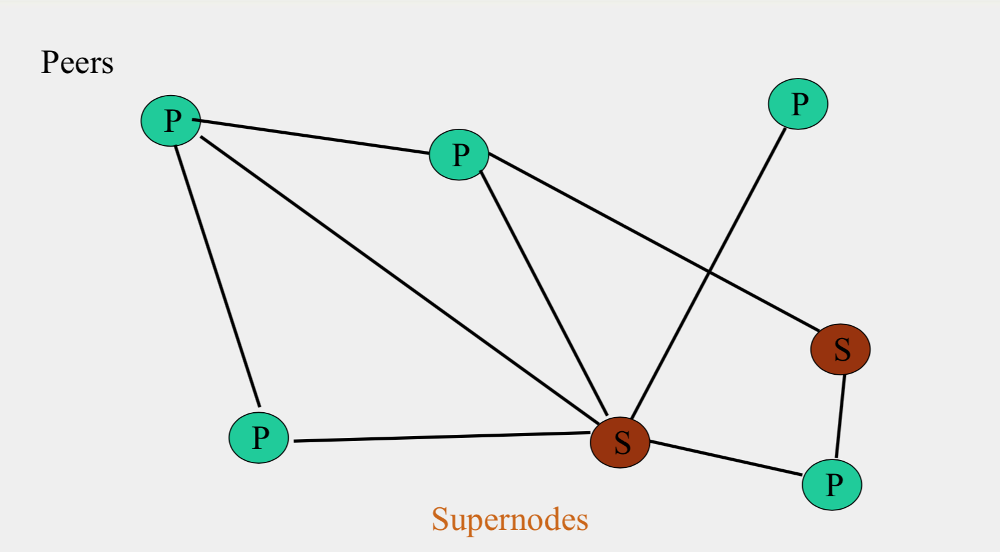
- A supernode stores a directory listing a subset of nearby (filename,peer pointer), similar to Napster servers
- Supernode membership changes over time
- Any peer can become (and stay) a supernode, provided it has earned enough reputation
- A peer searches by contacting a nearby supernode

## BitTorrent

### BitTorrent Structure
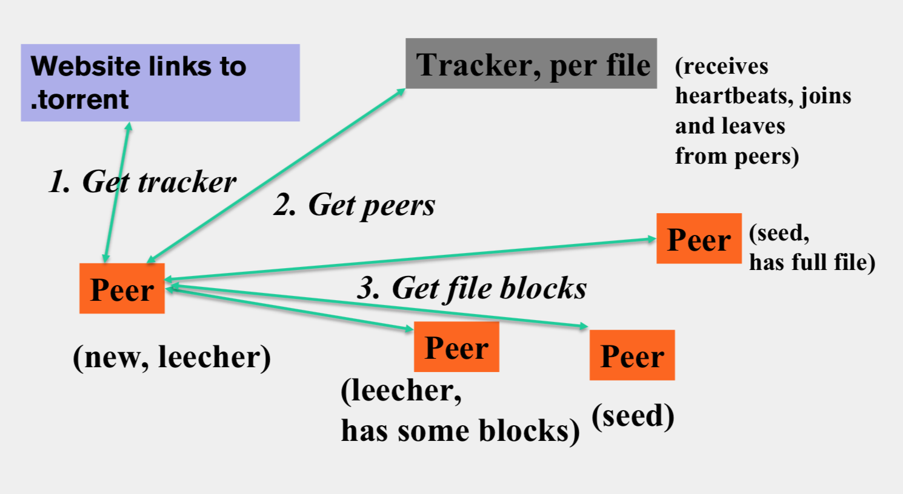
- File split into blocks (32 KB – 256 KB)
- Download Local Rarest First block policy: prefer early download of blocks that are least replicated among neighbors
- Tit for tat bandwidth usage: Provide blocks to neighbors that provided it the best download rates
- Choking: Limit number of neighbors to which concurrent uploads <= a number (5), i.e., the “best” neighbors

### BitTorrent 原理简述

**Reference from** [https://jaminzhang.github.io/p2p/BitTorrent-Principle-Introduction/](resources/https://jaminzhang.github.io/p2p/BitTorrent-Principle-Introduction/)


与传统客户端/服务器网络通信模式不同，对等方到对等方（P2P）通信模式在近年来越来越流行起来。
在 P2P 模式中，服务和资源分布化，资源不集中存储在某些设备上，而是分散存储在运行 P2P 程序的设备上，
每一个对等方都可以为其他对等方提供服务。
BitTorrent（中文全称比特流，简称 BT）是一个网络文件传输协议，是能够实现点对点文件分享的技术。
在大多数人感觉中与 P2P 成了对等的一组概念，而它也将 P2P 技术发展到了近乎完美的地步。
研究 BitTorrent 协议对我们深入把握 P2P 技术，了解 Interent 网络发展的未来走向有很大的意义。


BitTorrent 协议是架构于 TCP/IP 协议之上的一个 P2P 文件传输协议，处于 TCP/IP 结构的应用层。
BitTorrent 协议本身也包含了很多具体的内容协议和扩展协议，并在不断扩充中。
如果有多个下载者并发的下载同一个文件，则每个下载者也同时为其它下载者上传文件，
这样，文件源可以支持大量的用户进行下载，而只带来适当的负载的增长。

BitTorrent 协议把提供下载的文件虚拟分成大小相等的块，块大小必须为 2k 的整数次方
（由于是虚拟分块，硬盘上并不产生各个块文件），并把每个块的索引信息和 Hash 验证码
写入 .torrent 文件（即种子文件，也简称为“种子”）中，作为被下载文件的“索引”。 
下载者要下载文件内容，需要先得到相应的 .torrent 文件，然后使用 BT 客户端软件进行下载。 

下载时，BT 客户端首先解析 .torrent 文件得到 Tracker 地址，然后连接 Tracker 服务器。
Tracker 服务器回应下载者的请求，提供下载者其他下载者（包括发布者）的 IP。
或者，BT客户端也可解析 .torrent 文件得到 nodes 路由表，然后连接路由表中的有效节点，
由网络节点提供下载者其他下载者的 IP。

下载者再连接其他下载者，根据 .torrent 文件，两者分别对方告知自己已经有的块，
然后交换对方没有的数据。此时不需要其他服务器参或者其他网络节点的参与，
分散了单个线路上的数据流量，因此减轻了服务器负担。
下载者每得到一个块，需要算出下载块的 Hash 验证码与 .torrent 文件中的对比，
如果一样则说明块正确，不一样则需要重新下载这个块。

因此，下载的人越多，提供的带宽也越多，种子也会越来越多，下载速度就越快。

从 BT 客户端角度考虑，下载原理分为以下几步：

一．根据 BitTorrent 协议，文件发布者会根据要发布的文件生成提供一个 .torrent 文件。
客户端可从 Web 服务器上下载种子文件，并从中得到 Tracker 服务器 URL 和 DHT 网络 nodes 等信息。

二．根据 Tracker URL 与 Tracker 服务器建立连接，并从服务器上得到 Peers 信息。
或者根据 nodes 与 DHT 网络中节点通信，并从节点上得到 Peers 信息。

三．根据 Peers 信息与一个 Peer 建立连接，依据 Peer wire 协议完成握手，
并从 Peer 端下载数据文件。同时监听 Peer 的连接，并给 Peer 上传数据文件。

依据得到 Peers 信息的途径的不同，可分为使用 Tracker 服务器和使用 Trackerless DHT 网络两种方式。

基于 HTTP 的 Tracker 协议，
基于 UDP 的 Trackerless 协议，
基于 TCP 的 Peer wire 协议。

## Chord
Uses Consistent Hashing on node’s (peer’s) address
- SHA-1(ip_address,port) -> 160 bit string
- Truncated to m bits
- Called peer id (number between 0 and 2m −1 )
- Not unique but id conflicts very unlikely
- Can then map peers to one of 2m logical points on a circle


### Comparative Performance
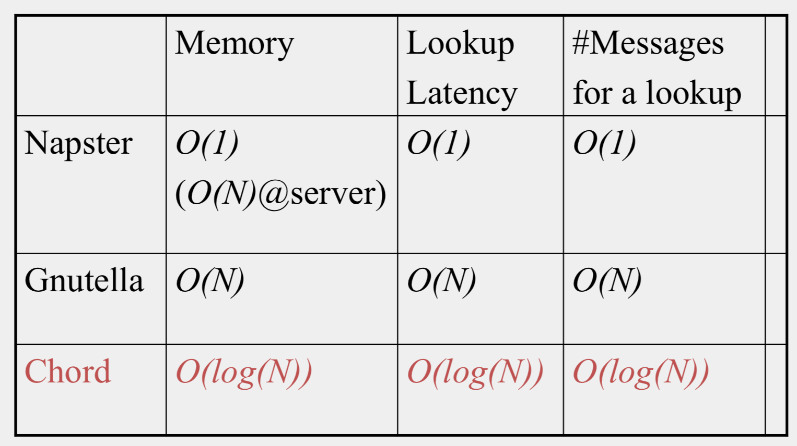

### Chord Structure
Tow pointers

#### successors
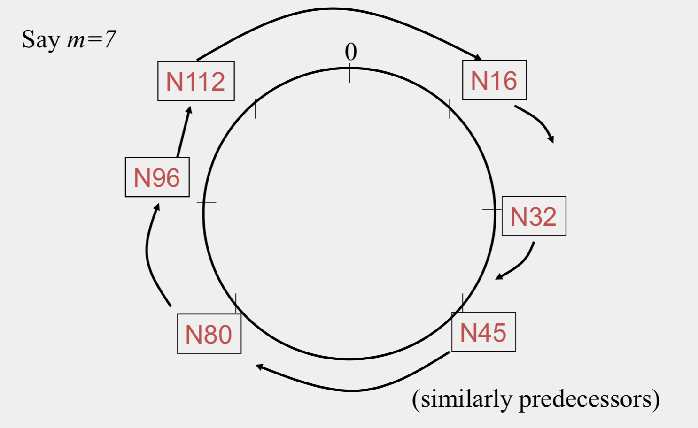
#### finger tables
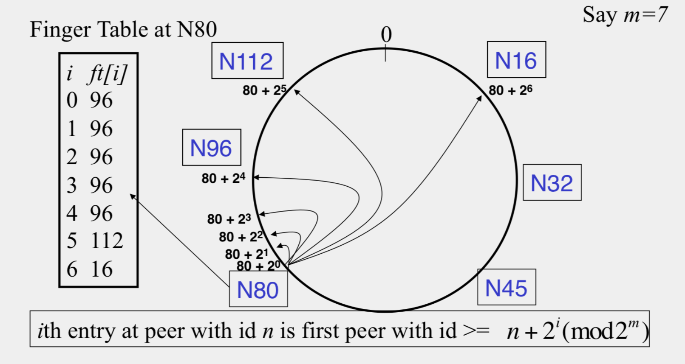

### Files
Filenames also mapped using same consistent hash function
- SHA-1(filename)->160 bit string (key)
- File is stored at **first peer with id greater than its key(mod 2^m)**
- Consistent Hashing => with K keys and N peers, each peer stores O(K/N) keys

### Search
-  At node n, send query for key k to largest successor/finger entry <= k if none exist, send query to successor(n) 
- 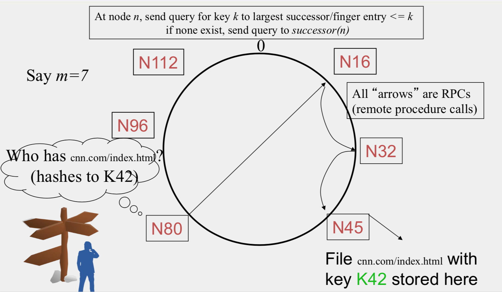
- Search takes O(log(N)) time
- O(log(N)) search time holds for file insertions too (in general for routing to any key)
- Failure in Chord
    - maintain r multiple successor entries
    - replicate file/key at r successors and predecessors

### Dynamic changes
- New peers joining 
    - Introducer directs N40 to N45 (and N32)
    - N32 updates successor to N40
    - N40 initializes successor to N45, and inits fingers from it N40 periodically talks to neighbors to update finger table
    - N40 may need to copy some files/keys from N45 (files with fileid between 32 and 40)
    - A new peer affects O(log(N)) other finger entries in the system, on average

- Stabilization Protocol
**Concurrent peer joins, leaves, failures might cause loopiness of pointers and failure of lookups**
    - Chord peers periodically run a stabilization algorithm that checks and updates pointers and keys

### Virtual Nodes
**Hash can get non-uniform -> Bad load balancing**
- Treat each node as multiple virtual nodes
behaving independently
- Each joins the system
- Reduces variance of load imbalance


## Pastry
- Assigns ids to nodes, just like Chord (using a virtual ring)
- **Leaf Set** – Each node knows its successor(s) and predecessor(s)
- Routing tables based prefix matching(Routing is thus based on prefix matching and is thus log(N))

### Pastry Locality
- For each prefix, say 011, among all potential neighbors with a matching prefix, the neighbor with the shortest round-trip time is selected
- Since shorter prefixes have many more candidates (spread out throughout the Internet), the neighbors for shorter prefixes are likely to be closer than the neighbors for longer prefixes
- Thus, in the prefix routing, early hops are short and later hops are longer


### Kelips
**A 1 hop Lookup DHT**

### Kelips Structure
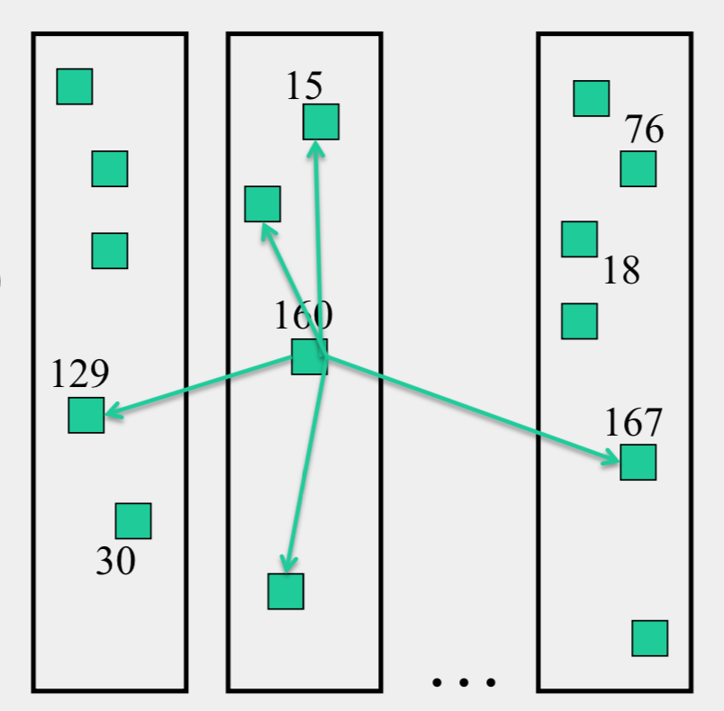
- k “affinity groups” k ~ sqrt(N)
- Each node hashed to a group (hash mod k)
- Node’s neighbors
    - (Almost) all other nodes in its own affinity group
    - One contact node per foreign affinity group
- File can be stored at any (few) node(s)
- Decouple file replication/location (outside Kelips) from file querying (in Kelips)
- Each filename hashed to a group
- All nodes in the group replicate pointer information, i.e., {filename, file location}
- Affinity group does not store files
- Lookup
    - Find file affinity group
    - Go to your contact for the file affinity group
    - Failing that try another of your neighbors to find a contact


**Reference from some slides from Coursera course [Cloud Computing](https://www.coursera.org/learn/cloud-computing)**